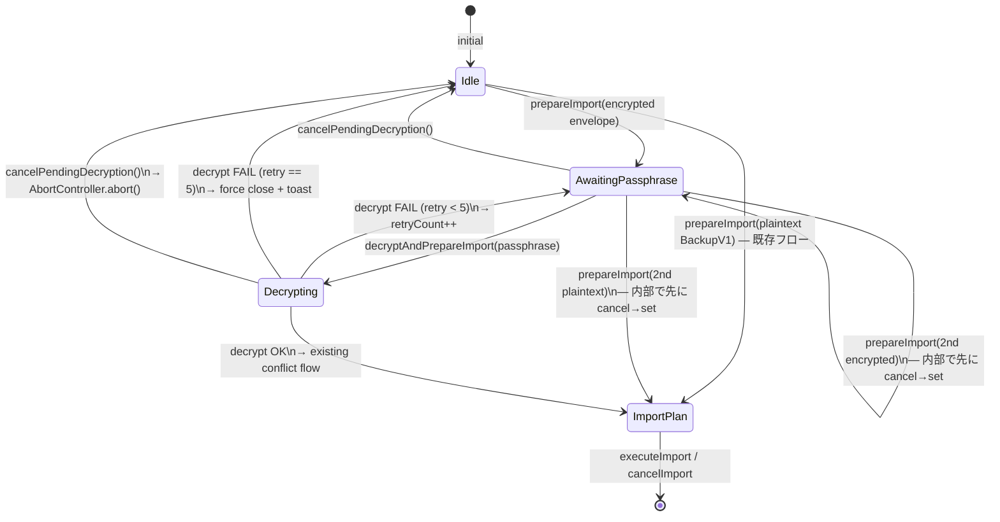

# M6 PR-C `pendingDecryption` State Machine

CLAUDE.md MUST「statusフィールドで処理状態を管理する設計 → 状態遷移図を先に作成」に従い、`pendingDecryption` の状態遷移を実装前に確定する。

実装タスク: `store/backupSlice.ts` への encrypt/decrypt 経路統合 (M6 PR-C)。

## 状態定義

```
pendingDecryption: null
  | { rawEnvelope: EncryptedBackupV1; retryCount: number; abortController: AbortController; isDecrypting: boolean }
```

| state | 意味 | UI 反映 |
|---|---|---|
| `null` (= idle) | encrypted import 待機なし | ImportPassphraseModal は mount しない |
| `{ ..., isDecrypting: false }` (= awaiting passphrase) | encrypted envelope 検出済、ユーザーのパスフレーズ入力待ち | ImportPassphraseModal mount、入力可能 |
| `{ ..., isDecrypting: true }` (= decrypting) | パスフレーズ受領、KDF/AES-GCM 実行中 | ImportPassphraseModal mount、入力 disabled、cancel ボタン enable |
| (`importPlan` set へ移行) | 復号成功 → conflict 検出フロー | ImportConflictModal mount |

## 遷移図 (Mermaid)



## 遷移ルールと禁則

### 許可される遷移
- `Idle → AwaitingPassphrase`: `prepareImport` で `EncryptedBackupV1` を検出
- `Idle → ImportPlan`: `prepareImport` で 平文 `BackupV1` を検出 (既存挙動)
- `AwaitingPassphrase → Decrypting`: ユーザーがパスフレーズを送信
- `AwaitingPassphrase → Idle`: `cancelPendingDecryption()` 呼び出し
- `Decrypting → ImportPlan`: 復号成功 → 既存 conflict 検出フローへ合流
- `Decrypting → AwaitingPassphrase`: 復号失敗 (retryCount < 5)、retryCount を increment
- `Decrypting → Idle`: 復号失敗 (retryCount == 5、上限到達) または cancelPendingDecryption

### 禁則 (illegal transitions)
- **`Idle → Decrypting` 直接遷移禁止**: `decryptAndPrepareImport` を `pendingDecryption === null` で呼ぶと `BackupValidationError({ cause: { kind: 'no-pending-decryption' } })` throw、state 不変
- **`AwaitingPassphrase` への暗黙上書き禁止**: 既存 `pendingDecryption` がある時に `prepareImport(2nd)` が呼ばれた場合、必ず `cancelPendingDecryption()` を**同期的に先**に呼んでから new state を set する (race-free)
- **`Decrypting` 中の二重 `decryptAndPrepareImport` 禁止**: 既存 `isDecrypting === true` 時の追加呼び出しは throw (`{ cause: { kind: 'concurrent-decrypt' } }`)

### 不変条件 (invariants)
1. `pendingDecryption !== null` の間は `importPlan === null` (相互排他)
2. `Decrypting → ImportPlan` 遷移時、`pendingDecryption` を `null` にしてから `importPlan` を set する (中間状態で両方 set にならない)
3. AbortController abort 後の KDF/decrypt 完了 handler は `signal.aborted` を check してから state 更新を skip (race-free closure)
4. `retryCount` は 0..5 範囲の整数。5 到達時は強制 close + トースト表示

## ModalManager 統合

| 状況 | 表示するモーダル |
|---|---|
| `pendingDecryption !== null` | `ImportPassphraseModal` (PR-D で実装) |
| `pendingDecryption === null && importPlan !== null` | 既存 `ImportConflictModal` |
| 両方 null | モーダルなし |

`pendingDecryption` が **`importPlan` より優先表示**される。M7-α `TermsConsentModal` の先頭分岐パターンと整合 (`needsTermsAccept && !isTermsDevBypass()`)。

## エラー文言 (AC-6)

| 状況 | UI 文言 |
|---|---|
| 復号失敗 (retry 1〜4) | `DECRYPT_FAILURE_MESSAGE` (定数、AC-2 と同一) + 「(あと N 回まで再試行できます)」 (※ 残回数の suffix は **UI 側** で `pendingDecryption.retryCount` から `MAX_DECRYPT_RETRIES - retryCount` として導出する。slice は文言生成しない) |
| 復号失敗 (retry 5、強制 close) | トースト「再試行回数の上限に達しました。ファイルとパスフレーズを確認してください。」 |
| `cancelPendingDecryption()` | トースト無し (ユーザー意図のキャンセル) |
| `prepareImport(2nd)` で上書き発生 | トースト「進行中の復号処理を中断しました」 |

## 実装注意点

1. **AbortController は state 内に保持**: 各 `decryptAndPrepareImport` 呼び出しで新規 controller を生成。`cancelPendingDecryption` は `controller.abort()` を呼んだ上で state を init
2. **race-free 上書き**: `prepareImport` 冒頭で既存 `pendingDecryption` があれば `cancelPendingDecryption()` を**同期実行**してから new state set
3. **decrypt 完了 handler の guard**: `await decryptBackup(...)` 後に `signal.aborted` を check し、true なら state 更新せずに return (古い session の resolve が新 session を上書きする race を防止)
4. **retry counter のリセット**: cancel / 新規 prepareImport 時に必ず 0 にリセット (5 回上限の意図は「同一 envelope 内」)

## テスト要件 (PR-C vitest)

state machine 遷移テストとして以下を網羅:

- T1: Idle → AwaitingPassphrase (encrypted envelope detection)
- T2: Idle → ImportPlan (plaintext BackupV1 既存挙動 regression)
- T3: AwaitingPassphrase → Decrypting → ImportPlan (happy path)
- T4: AwaitingPassphrase → Decrypting → AwaitingPassphrase (retry 1〜4)
- T5: AwaitingPassphrase → Decrypting → Idle (retry == 5、強制 close)
- T6: AwaitingPassphrase → Idle (cancel)
- T7: Decrypting → Idle (cancel during KDF、AbortController.abort 連動)
- T8: Idle → Decrypting 直接呼び出しが throw (`no-pending-decryption`)
- T9: AwaitingPassphrase → AwaitingPassphrase (2nd prepareImport 上書き、cancel→set 順序保証)
- T10: AwaitingPassphrase → ImportPlan (2nd prepareImport が plaintext)
- T11: Decrypting 中の 2nd `decryptAndPrepareImport` が throw (`concurrent-decrypt`)
- T12: Race - decrypt 完了が cancel 後に来た場合 state 更新 skip
